# Семантика и разметка документа

## Семантика
Разобраться в том, что такое семантика, нам помогут несколько примеров.

### Заголовки

- С момента появления рукописи люди старались визуально выделить название текста. Так появился заголовок

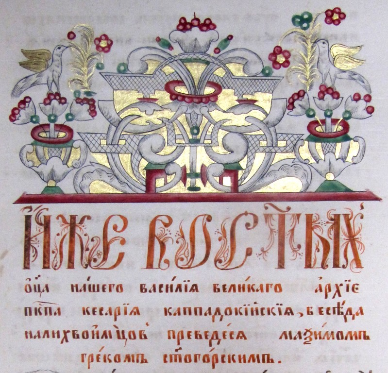

- Эта традиция сохранилась и с появлением печатных книг

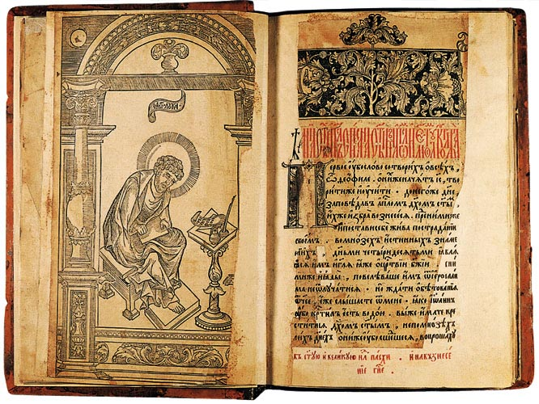

- И сохранилась до текущего времени

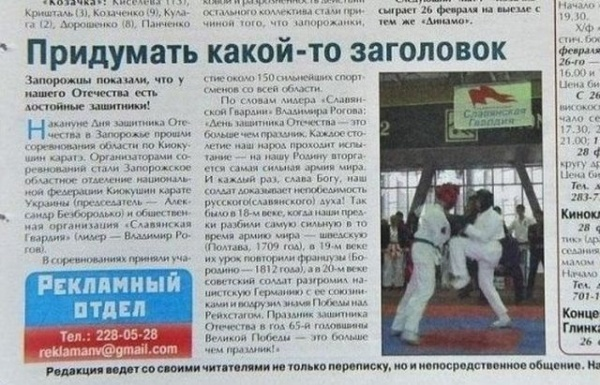

### Заголовки разных уровней

Для того, чтобы текст был логически упорядоченным не всегда достаточно одного заголовка.
- Например, для разделения текста на главы.

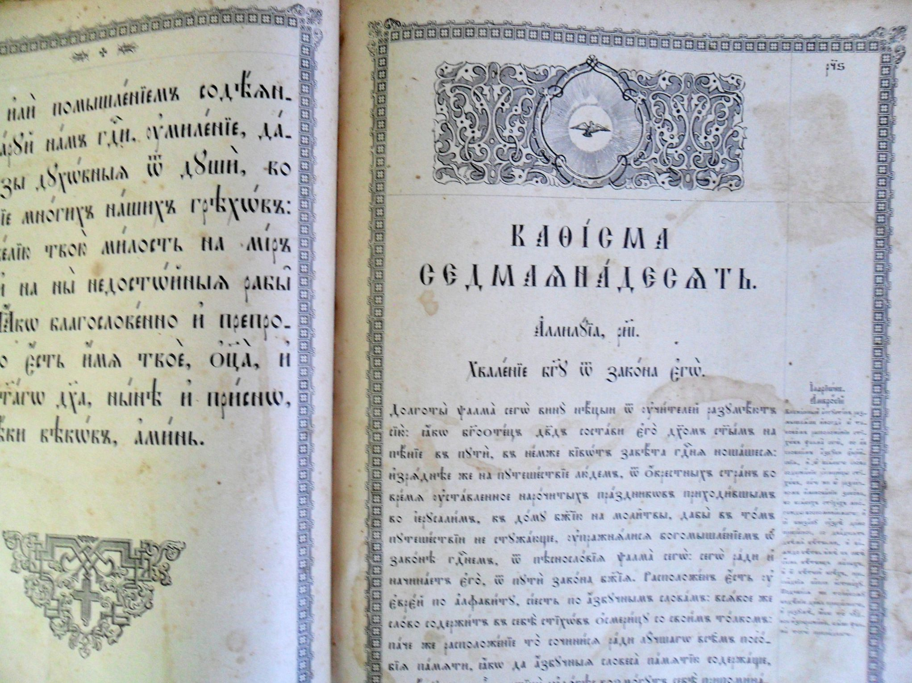

- Для дополнения основного заголовка (подзаголовок) или разделения уровней значимости новостей.
На этой газетной странице видно сразу пять уровней заголовков.

- В одном тексте можно (и нужно) комбинировать несколько уровней заголовков, если того требует смысл.

### Абзацы
Разделение текста на абзацы для простоты чтения и восприятия так же существовало всегда.

- В книжных текстах для разделения текста на абзацы текст писали с новой строки, а первую букву делали большой, красочной и украшали ее вензелями.

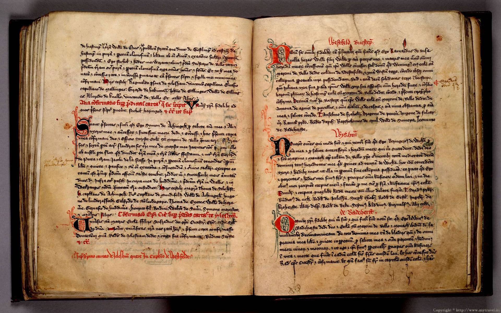

- После появления печатных книг этот прием сохранялся еще какое-то время

- Но теперь для абзацев используется красная строка и отступ от левого края страницы. Кстати, этот отступ – все, что осталось от большой и красочной первой буквы.

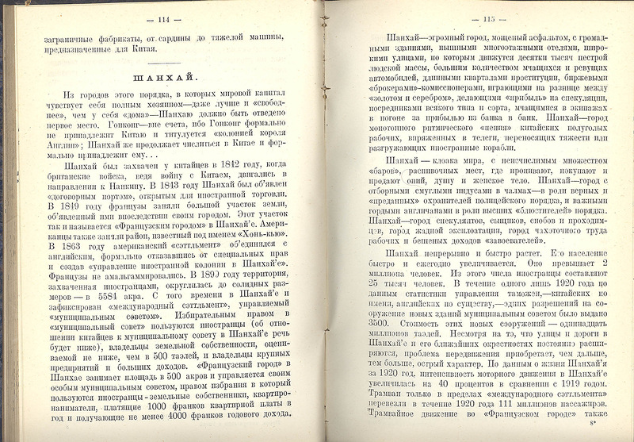

- На сайтах также используется разделение на абзацы. Тепографические принципы применимы и здесь.

### Цитата
Цитаты нужны для вставки в текст части другого текста или прямой речи человека.

- Цитаты часто используются в печатных книгах

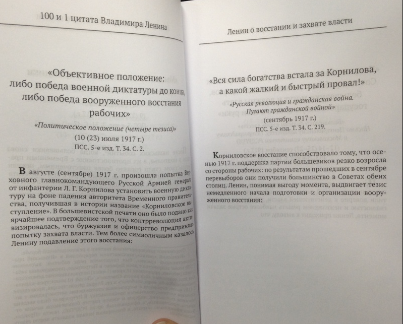

- Сайты во многом переняли традиции печатного текста, поскольку они привычны всем людям и просты для восприятия. На сайтах цитаты принято оформлять карсочно и ярко.

### Маркированный список
- Списки часто используются как в обычной жизни

- так и в печатной литературе, на сайтах

- Список ложится в основу популярных todo-сервисов

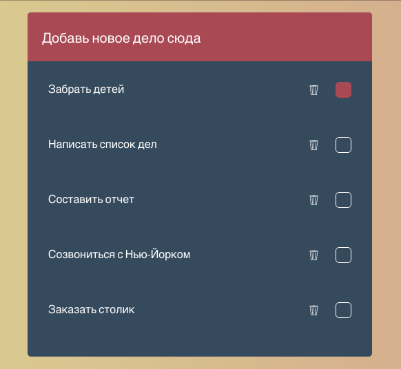

### Нумерованный список

Если в списке важен порядок дейтсвий, то применяется нумерованный список.

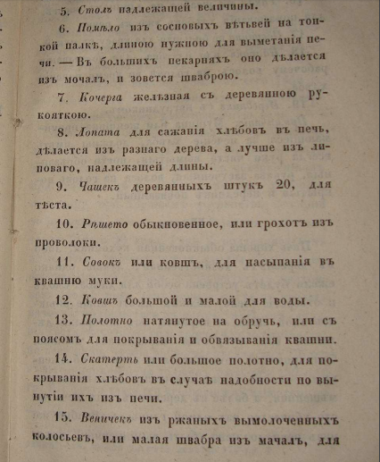

### Иллюстрации

- Иллюстрации в тексте оживляют историю

- Или наглядно отражают описанные данные

- «Страна должна знать своих героев!»

- Часто под фотографией или изображением идет подпись, поясняющяя, что именно изображено.

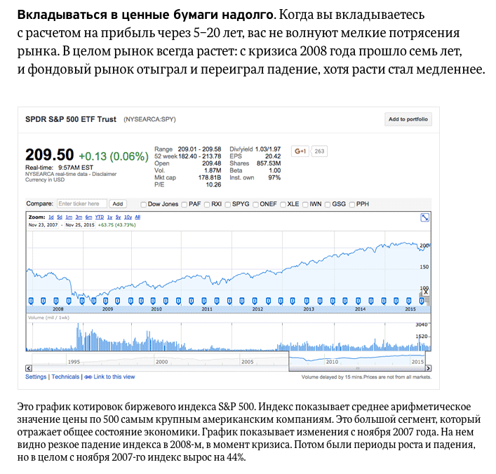

- Иногда картинка и текст тесно перелетаются и одно без другого будет неполноценным

## Семантическая разметка

Все или по крайней мере большую часть из этого вы делали самостоятельно. Например, в программе MS Word при написании рефератов, диплома или рабочих текстов.

Есть вариант выделять заголовки просто более крупным размером шрифта или жирным начертанием

- Задавайте заголовки при помощи специальных стилей

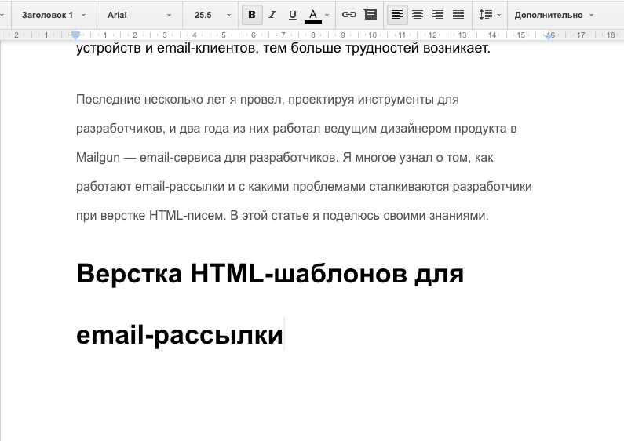

Это даст вам возможность быстро составить оглавление, буквально в два клика.

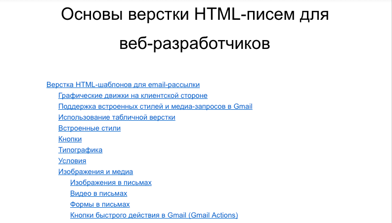

- Если вы просто выделите текст при помощи более крупного размера шрифта и/или жирного начертания, то оглавление придется составлять вручную, что займет гораздо больше времени, чем при правильном оформлении текста.

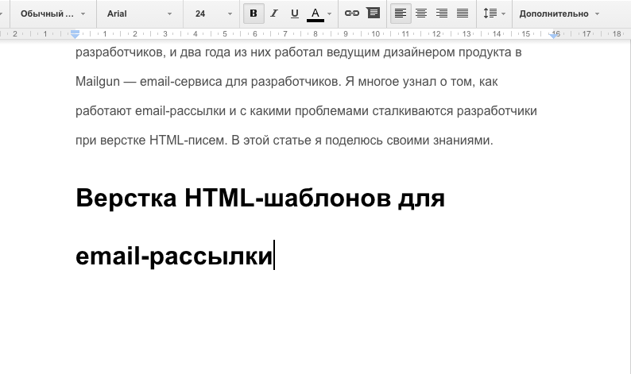

## Разметка в браузере
Правильно определять разметку текста нам помогает накопленный опыт (много книг прочитано, обучение в школе и т.д.).
Но у браузера нет подобного опыта.
Браузер видит текст и выводит его на страницу следующим образом:

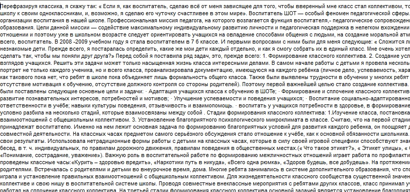

Если мы «отдадим» браузеру документ, в котором правильно будут отмечены заголовки, абзацы, списки, картинки, то он без проблем отобразит страницу именно так, как нам нужно.

Осталось понять, как, при помощи каких инструментов мы можем указать брузеру где какой элемент находится. 
