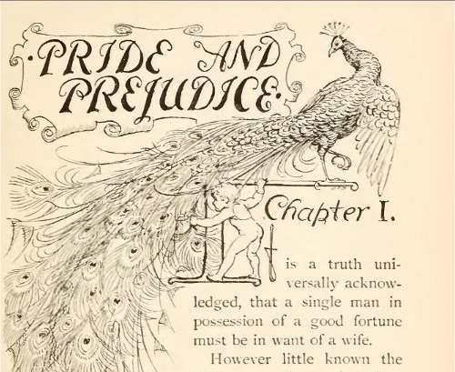
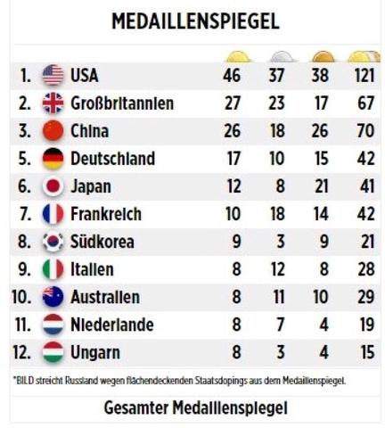
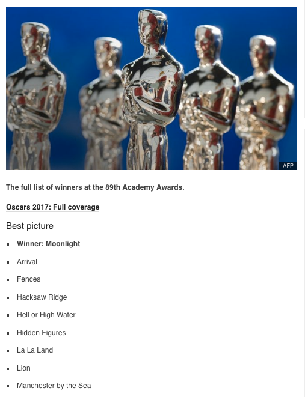

# Семантика и разметка документа

## Введение
Перед тем, как мы с вами начнем изучать техническую сторону HTML и CSS нам следует поговорить об очень важном теоретическом понятии.
Речь пойдет о семантике.

## Семантика
Чтобы объяснить что такое семантика давайте посмотрим на несколько текстов.

Даже не особо вчитываясь каждый из нас может с первого взгляда определить что «The Peg» является заголовком главы. Под ним идет эпиграф. Дальше начинается основной текст, в котором мы четко видим разделение на абзацы.

Так мы можем определить структуру любой книги, статьи, рукописного текста, если они оформлены по общепринятым нормам.

Давайте попробуем еще раз.

В этом случае на странице есть большой рисунок, призваный украсить книгу. Но тем не менее это не мешает нам увидеть заголовок, знавание главы и основной текст, разбитый на абзацы.

В этом примере вы видите таблицу. Мы можем это определить по тому, что информация расположена в четкие столбцы.

На сайте BBC находится список всех победителей премии Оскар за 2017 год. Мы точно можем сказать, что это список – информация расположена друг под другом и каждый пункт отмечен маркером.

## Семантичная разметка

Правильно определять разметку текста нам помогает накопленный опыт (много книг прочитано, обучение в школе и т.д.).
Но у браузера нет подобного опыта.
Браузер видит текст и выводит его на страницу следующим образом:

Что же нужно сделать для того, чтобы пользователь нашего сайта увидел привычные заголовки, главы, абзацы, списки и таблицы там, где это нужно?

В этом нам поможет семантика, а точнее правильно подобранные по смыслу элементы.

Всем известный текстовый редактор.

Представим, что вы пишите диплом. Теоретически вы можете выделить заголовки просто бОльшим шрифтом. Но в этом случае оглавление придется писать вручную. Если использовать соотвтетсующие стили (Заголовок 1, Заголовок 2 и т.д.), то оглавление можно будет составить автоматически.

Примерно так же работает отображение страницы сайта. Вы можете задать просто другие стили чтобы текст выглядел как заголовок, например. Но в этом случае браузер, поисковые роботы и другие механизмы интернета не смогут правильно понять вашу страницу. 

Дальше по ходу курса мы познакомимся с набором инструментов, при помощи которых браузер сможет понять структуру вашего документа и правильно показать ее посетителю вашего сайта.
