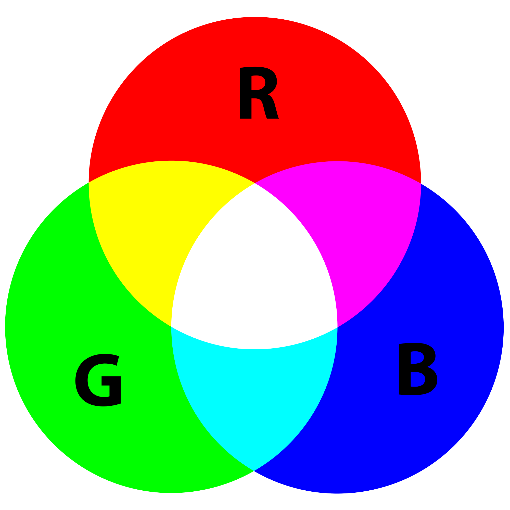
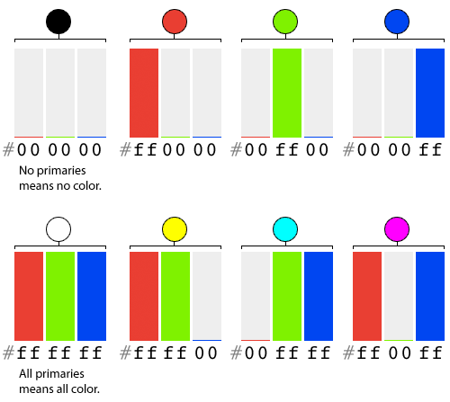
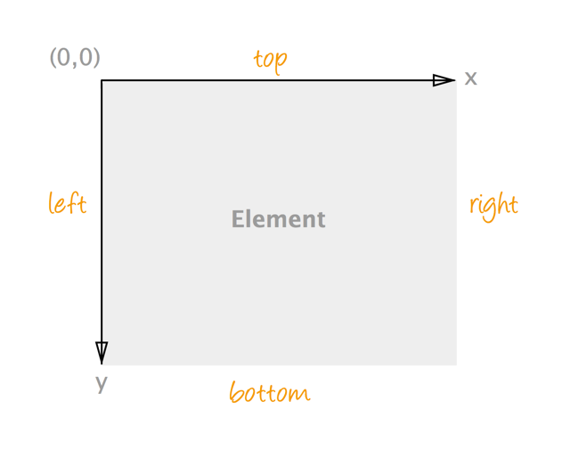

# 2.2. Оформление текстовых блоков с помощью CSS

## Селектор класса
На прошлом занятии мы познакомились с вами с понятием CSS правила и его составных частей. Теперь мы умеем выбирать блоки по тегу, а также записывать более сложные условия благодаря зависимостям(каскаду). Но часто бывает так, что этого все равно недостаточно:

    <h2>Заголовок 1</h2>
    <h2>Заголовок 2</h2>
    <h2>Заголовок 3</h2>

Как быть, если мы хотим стилизовать только некоторые заголовки на нашей странице? или например, задать разные цвета каждому заголовку? Конечно, с одной стороны, мы бы могли поместить каждый заголовок внутрь разных блоков - section, blockquote и на основе этого задать стили. Но согласитесь, это очень неудобный вариант, к тому же лишняя разметка нам совершенно ни к чему.
Для того, чтобы все-таки задать особые стили одинаковым по типу тегам, есть возможность обращаться к тегу по имени класса - специального атрибута.
Чтобы у нас была такая возможность, сначала мы должны в нашем html создать такой атрибут у тега:

    <h2 class=”main-header”>Заголовок 1</h2>
    <h2>Заголовок 2</h2>
    <h2>Заголовок 3</h2>

Теперь мы можем задать особые стили первому заголовку следующим образом:

    .main-header {
    	color: red;
    	font-size: 50px;
    }

Чтобы обращаться к тегу по имени класса, нужно записать это имя с точкой перед началом: 

    .имя_класса {
    	свойство : значение;
    }

(важно: имя класса в css стилях должно в точности совпадать с именем атрибута класса, записанного в разметке, например `<h2 class=”main-head”>
` и `.main-header` не будут совпадать, наше правило не сработает).

Также мы можем комбинировать селектор класса с селекторами тега:

    <h2 class=”header”></h2>
    <h3 class=”header”></h3>

`h2.header`выберет все теги `h2`, одновременно имеющие класс `.header`, т.е. в разметке выше только первый заголовок(h2) будет выбран, но не второй.
Давайте вспомним материал прошлого урока, а также применим полученные только что знания, и вместе попробуем найти ответы на вопросы:
Разметка:

    <h1 class=”header”>Заголовок</h1>
    
Lorem ipsum….
 
    
Text

    
Text

    
Text

    
Text

    <ul class=”big”>
    	<li  class=”first-level”>item 1</li>
    	<li  class=”first-level”>item 2</li>
    	<li  class=”first-level”>item 3
		    <ul>
		    	<li>item 1</li>
		    	<li>item 2</li>
		    	<li>item 3</li>
		    </ul>
	    </li>
    </ul>
    <ol>
    	<li class=”first-level”>item 1</li>
    	<li class=”first-level”>item 2</li>
    	<li class=”first-level”>item 3</li>
    </ol>

## Основные характеристики шрифта
На прошлом занятии мы уже успели познакомиться с некоторыми свойствами, при помощи которых мы можем управлять внешним видом шрифта. Давайте вспомним, какие это были свойства:

* **font-size** - задает размер шрифта
* **font-weight** - задает жирность шрифта
* **font-style** - задает стиль начертание шрифта
* **color** - задает цвет шрифта

Но это еще не все, также мы можем управлять еще несколькими параметрами.
**font-family** - гарнитура шрифта - serif, sans-serif, Arial
Все вышеперечисленные свойства, кроме цвета, можно записать в сокращенной форме свойства font, например:

    font: italic bold 20px serif;

## Преобразования текста
Также мы можем управлять такими характеристиками, как:

* line-height - междустрочный интервал
* text-decoration - underline сделает надпись подчеркнутой, overline добавит линию выше надписи, line-throught - для перечеркнутой надписи
* text-transform - uppercase сделает все символы заглавными, lowercase сделает все символы строчными
* text-aligh - позволяет задавать выравнивание текста left, right - по левому и правому краю соответственно, center - по центру, justify - по ширине

## Свойства для списков
Списки имеют особенные свойства, помогающие стилизовать их:

* **list-style-type** - свойство определяет тип маркера. Для маркированных списков доступны значения
	* *disc* - значение по умолчанию, заполненный кружок
	* *circle* - “пустой” кружок
	* *square* - квадратик
для нумерованных -
	* *decimal* - значение по умолчанию, арабские цифры
	* *lower-roman* -  строчные римские цифры, например i , ii , iii и т.д.
	* *upper-roman* - заглавные римские цифры, I, II , III и т.д.
	* *lower-alpha* - строчные буквы латинского алфавита, a, b, c и т.д
	* *upper-alpha* - заглавные буквы латинского алфавита A, B, C и т.д.
* *list-style-image* - свойство позволяет установить любую картинку в качестве символа маркера, например: list-style-image:url(‘marker.jpg’);
* *list-style-position* - позволяет указать положение маркера списка - outside для положения снаружи(является значением по умолчанию), inside - внутри.

## Цвета в hex, rgb, rgba
На прошлом занятии мы задавали цвет при помощи ключевых слов. Но у нас есть ограниченное количество ключевых слов. Как же быть, если нужно задать какой-то особенный цвет, для которого нет ключевого слова?
К нашим услугам несколько доступных вариантов задания цвета.

Для браузеров используется **RGB** модель цветовоспроизведения, где R, G, B - первые буквы основных цветов(красный, зеленый, синий) - и выбор именно этих цветов обусловлен особенностями цветовосприятия человеческого глаза. Согласно этой модели, любой цвет является результатом смешения основных цветов в разных пропорциях.
Как же мы можем представить цвет согласно этой модели, в числовом выражении?

Самым популярным способом является задание цвета с помощью 16-ричного кода(hex-формат).
В этом случае цвет записывается в виде 6-ти значного кода *#RRGGBB*, где *RR* означает интенсивность красного, *GG* - интенсивность зеленого, *BB* - интенсивность синего цвета, согласно модели RGB. Каждая из трех интенсивностей может принимать значения от 0 до 255, и записывается при помощи 2х значного 16-ричного кода.
Например: *color: #000000;* - черный цвет, *color: #ff00ff;* - цвет фуксии.

Также можно задать цвет в rgb-формате: воспользовавшись функцией **rgb(r, g, b)** где соответственно r, g и b - соответствующие интенсивности красного, зеленого и синего цветов.
Например: *color: rgb(0,0,0);* - черный цвет, *color: rgb(255, 0, 255);* - цвет фуксии.
Но это еще не все: мы можем задать полупрозрачный цвет, воспользовавшись функцией **rgba(r,g,b,a)**, где параметры r,g и b имеют точно такой же смысл, как и в функции rgb,  а последний, четвертый параметр “a” может принимать значения от 0 до 1 и означает степень непрозрачности цвета, где 0 - полная прозрачность, 1 - полная непрозрачность.
*color: rgba(0,0,0,0.5)* - черный цвет, прозрачный наполовину
*color: rgba(255,0,255,0.2)* - цвет фуксии с 20%-ной непрозрачностью.

## Свойства фоновых изображений
Используя все доступные нам цветовые форматы, мы можем менять не только цвет текста, но также и менять параметры фона.
Например, мы можем задать синий фон у блока так:

    background-color: blue;

или так:

    background-color: #0000ff;

Давайте рассмотрим еще несколько свойства фона, на которые мы можем повлиять:

* **background-image** - задает фоновое изображение. Нужно указать путь до изображения в формате: url(“путь/до/picture.jpg”)
* **background-repeat** - позволяет указать, хотим ли мы, чтобы заданное нами фоновое изображение повторялось: возможные значения - no-repeat - изображение повторяться не будет, отобразится только 1 раз: repeat-x - изображение будет повторяться только по оси x, repeat-y - изображение будет повторяться только по оси y, repeat(по умолчанию) - изображение будет повторяться по обеим осям - и x, и y
* **background-position** - позволяет задать положение фонового изображения. Можно указывать координаты относительно верхнего левого угла в px, можно указать ключевые слова(для каждой из 2х осей) - top, bottom, left, right или center

